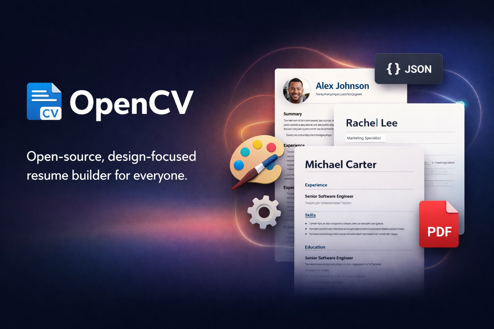

[](docs/assets/images/banner.png)

# OpenCV Resume Builder

OpenCV is a modern, AI-powered resume (CV) builder web application. It helps users create, edit, and export professional resumes with ease, leveraging smart suggestions and beautiful templates.

## Features

- ✨ **AI Suggestions**: Get smart, context-aware suggestions for resume content.
- 🖋️ **Rich Text Editing**: Flexible, intuitive editor for all resume sections.
- 🎨 **Beautiful Templates**: Choose from multiple modern, minimal, and classic templates.
- 🕒 **Version History**: Track changes and revert to previous versions of your CV.
- 📄 **Export Options**: Export your resume as PDF or HTML.
- 🔗 **LinkedIn Import**: Quickly import your LinkedIn profile data.
- 📱 **Responsive Design**: Works great on desktop and mobile devices.

## Getting Started

### Prerequisites
- [Node.js](https://nodejs.org/) (v18+ recommended)
- [pnpm](https://pnpm.io/) (or npm/yarn)

### Installation

1. **Clone the repository:**
   ```bash
   git clone https://github.com/brionmario/opencv.git
   cd opencv
   ```
2. **Install dependencies:**
   ```bash
   pnpm install
   ```
3. **Run the development server:**
   ```bash
   pnpm dev
   ```
4. **Open your browser:**
   Visit [http://localhost:3000](http://localhost:3000)

## Project Structure

- `apps/opencv/` — Main Next.js application
- `apps/opencv/components/` — UI and CV builder components
- `apps/opencv/lib/` — Utility libraries and logic
- `docs/` — Documentation and assets

## Contributing

Contributions are welcome! Please open issues or pull requests for bug fixes, features, or improvements.

## License

This project is licensed under the MIT License. See the [LICENSE](LICENSE) file for details.

---

Made with ❤️ by [@brionmario](https://github.com/brionmario) and contributors.
